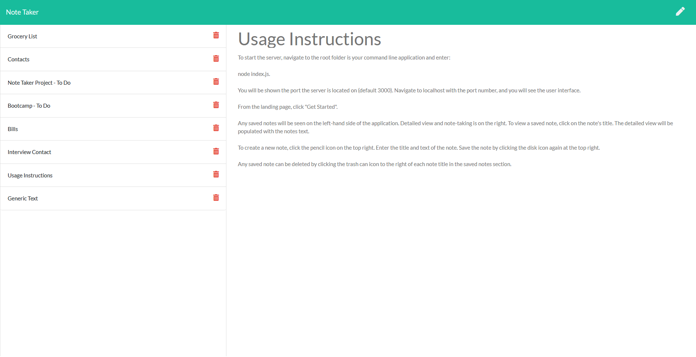

# Note Taker

## Description

Note taking app. Stores user notes to file on their local machine. Allows for creating, saving, and deleting notes.

## Table of Contents

* [Installation](#Installation)
* [Usage](#Usage)
* [License](#License)
* [Contribution](#Contribution)
* [Tests](#Tests)
* [Contact](#Contact)

## Installation

Clone the project from github. Navigate to the root directory, and run: 
    
    npm install.

## Usage

To start the server, navigate to the root folder is your command line application and enter:

    node index.js. 

You will be shown the port the server is located on (default 3000). Navigate to localhost with the port number, and you will see the user interface.

From the landing page, click "Get Started".

Any saved notes will be seen on the left-hand side of the application. Detailed view and note-taking is on the right. To view a saved note, click on the note's title. The detailed view will be populated with the notes text.

To create a new note, click the pencil icon on the top right. Enter the title and text of the note. Save the note by clicking the disk icon again at the top right.

Any saved note can be deleted by clicking the trash can icon to the right of each note title in the saved notes section.

## License

Note Taker is licensed under the [MIT](https://opensource.org/licenses/MIT) license.

## Contribution

N/A

## Tests

N/A

## Contact

Reach out to me at the following

* Github: [https://github.com/nbur4556](https://github.com/nbur4556)
* Email: nbur4556@gmail.com
    